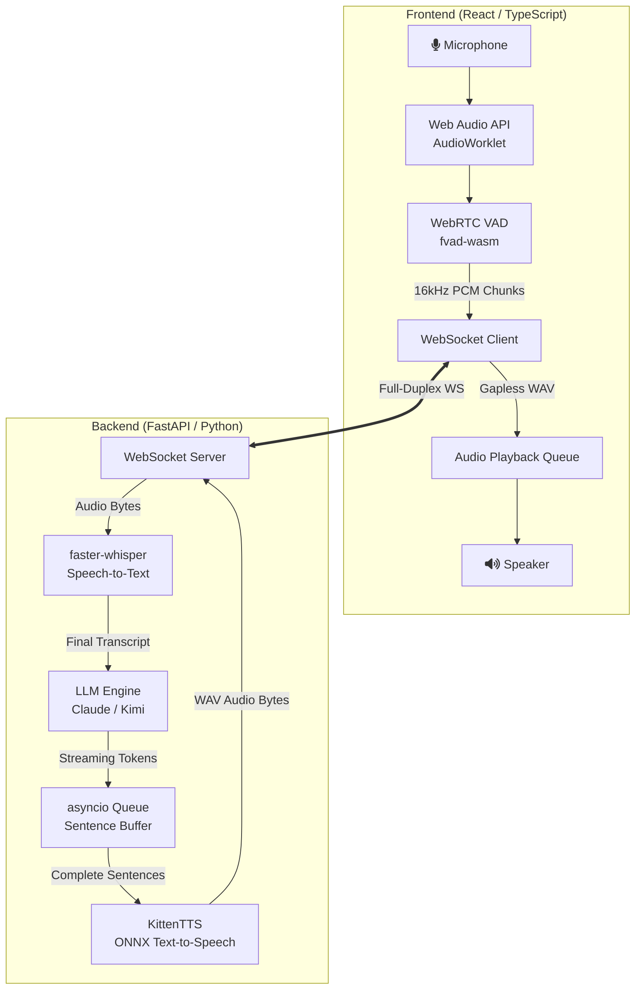
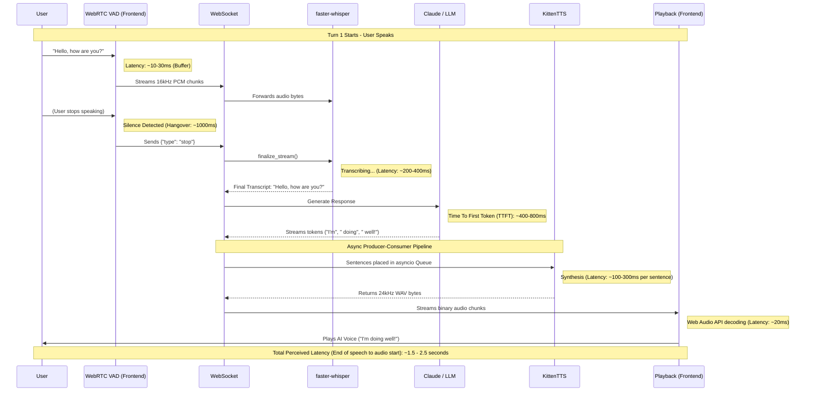

# VoiceArch Streaming: System Architecture & Data Flow

This document details the complete end-to-end architecture of the real-time AI voice agent. The system is designed for low latency, utilizing streaming WebSockets, concurrent processing, and a heavily optimized audio pipeline.

## High-Level Architecture

The architecture consists of a React-based frontend that handles real-time audio processing and a FastAPI Python backend that coordinates the AI models (ASR, LLM, TTS) using an asynchronous producer-consumer pipeline.

> [!NOTE]
> **Barge-in (Interruption)**: If the WebRTC VAD detects the user speaking (above a dynamic threshold) while the AI is playing audio, the frontend instantly halts the `PlaybackQueue` and sends an `interrupt` signal to the `WS_Server`. The backend immediately cancels the active LLM and TTS tasks, readying the system for the user's new input.

---

## Complete Pipeline Flowchart & Latency Breakdown

The following sequence diagram illustrates the exact chronological flow of data during a single conversation turn, along with the approximate latency introduced at each step.

## Technology Stack Summary

### Frontend
*   **Framework**: React 19, TypeScript, Vite
*   **Audio Capture**: Web Audio API `AudioWorklet` for main-thread-blocking free audio processing.
*   **Silence Detection / Barge-in**: `@echogarden/fvad-wasm` (WASM port of Google's WebRTC VAD algorithm). Calibrates to room noise dynamically.
*   **Playback**: Custom `AudioPlaybackQueue` utilizing `AudioContext` for seamless, gapless stitching of incoming audio chunks.

### Backend
*   **Server**: FastAPI & Uvicorn (Asynchronous WebSocket routing).
*   **ASR (Speech-to-Text)**: `faster-whisper` (CTranslate2). Highly optimized for rapid real-time partial/final transcriptions.
*   **LLM Engine**: `ollama` / `sllm` (Running models like Claude or Kimi). Integrated as an async streaming generator.
*   **TTS (Text-to-Speech)**: `KittenTTS`. An ultra-lightweight (25-80MB) CPU-only ONNX model capable of synthesizing speech significantly faster than real-time.

> [!TIP]
> **Performance Optimization**: The backend utilizes an overlapping asynchronous pipeline. While the TTS engine is synthesizing Sentence 1, the LLM is already generating Sentence 2, and the frontend is actively playing the audio for Sentence 1. This drastically reduces perceived latency.
